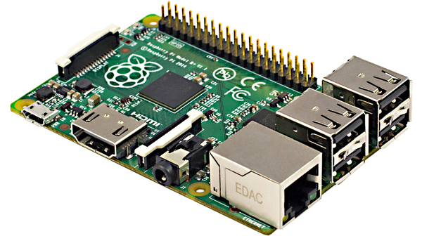

<div align="center">
    <p align="center">
        <a href="https://github.com/ferenconvonmatterhorn/armv6-node-exporter">
            
        </a>

<h3 align="center">ARMv6 Prometheus Node Exporter for RPI1</h3>
</p>
</div>

## Example
Grafana Dashboard with metrics from the RPI1
<div align="center">
    <p align="center">
            
<h3 align="center">ARMv6 Prometheus Node Exporter for RPI1</h3>
</div>

## How to use
# docker
```bash
$docker run -d -p 9100:9100 ferenco42/armv6-node-exporter:<tagname>
```
# docker-compose
```yaml
version: '3.3'

services:
  armv6-node-exporter:
    container_name: arm-prom-exporter
    image: ferenco42/armv6-node-exporter:<tagname>
    ports:
      - 9100:9100
```